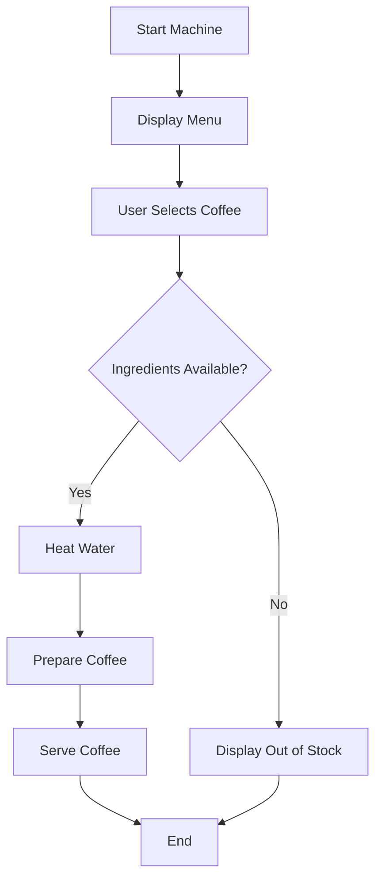

---

☕ Coffee Making Machine – Simple Program

A **simple coffee making machine program** that simulates the working of an automatic coffee machine.
This project demonstrates **basic programming logic, control flow, and user interaction** in a clear and beginner-friendly way.

---

📌 Project Description

The Coffee Making Machine program allows a user to:

* Select a type of coffee
* Check ingredient availability
* Process coffee preparation
* Display status messages

This project is ideal for **students and beginners** learning programming fundamentals.

---

🎯 Features

* Coffee selection (e.g., Espresso, Latte, Cappuccino)
* Ingredient availability check
* Step-by-step coffee preparation
* Simple and readable logic
* Console-based output

---

🧰 Technologies Used

*(You can modify this section based on your program)*

* **Programming Language:** Python / C / Java (Simple logic-based program)
* **Concepts Used:**

  * Conditional statements
  * Functions
  * Variables
  * Loops (optional)

---

📂 Project Structure

```
coffee-machine-program/
│
├── coffee_machine.py      # Main program file
├── ingredients.py         # Ingredient data (optional)
├── README.md              # Project documentation
```

---

🔄 Coffee Machine Working Flow Diagram



---

⚙️ System Architecture Diagram


---

🧠 Program Logic Overview

1. Start the coffee machine
2. Display available coffee options
3. User selects coffee type
4. Machine checks ingredients
5. If available:

   * Water is heated
   * Coffee is prepared
   * Coffee is served
6. If not available:

   * Display error message
7. End program

---

▶️ How to Run the Program

Example (Python):

```bash
python coffee_machine.py
```

Example (C):

```bash
gcc coffee_machine.c -o coffee
./coffee
```

---

🛠️ Sample Coffee Options

* Espresso
* Cappuccino
* Latte
* Black Coffee

---

 🚀 Future Enhancements

* Add sugar and milk customization
* Add payment system simulation
* Ingredient refill option
* GUI version
* Real-time timer simulation

---

📸 Screenshots (Optional)

Add screenshots of:

* Program output
* Menu display
* Coffee preparation steps

---

📄 License

This project is licensed under the **MIT License**.

---

🙌 Acknowledgements

* Designed for academic and learning purposes
* Inspired by real-world coffee vending machines

---

